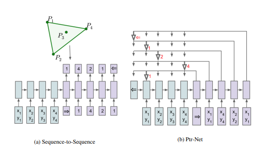

# PointerNetworks

This repo is an implimentation of the paper [Pointer Networks](https://arxiv.org/pdf/1506.03134.pdf) by Vinyals et al. 

I've used a simple LSTM encoder-decoder to replicate the results, but suggest that users reserach better ways to encoder the input recognizing that the inputs are actually a set and not order dependent.

     

Todo List:
 - [ ] Beam Search
 - [ ] Set encoding for Encoder